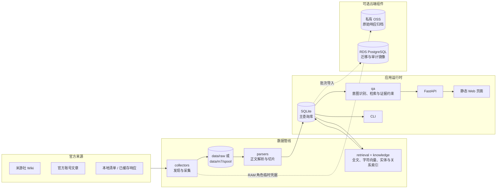

# 崩坏：星穹铁道剧情与设定知识库

一个本地优先、以官方文本为证据边界的剧情与设定问答原型。回答中的每项主张都必须绑定可展开的官方来源；证据不足时系统拒绝补充模型记忆中的事实。

这个项目源于个人阅读剧情、梳理设定和创作《崩坏：星穹铁道》同人作品时的娱乐需求：希望随时查清人物、事件、地点与阵营之间的关系，也希望每个答案都能回到原文，而不是依赖模糊记忆或模型自由发挥。它既是一个自用的写作资料助手，也是一次对“有据可查的游戏知识问答”的技术实验。

## 当前能力

- 采集并解析官方 Wiki、官方文章、PV 与动画资料；
- 使用全文、字符向量和实体信号进行混合检索；
- 输出逐条主张、稳定证据 ID、原文、上下文和官方链接；
- 展示经过审核并绑定证据的一跳知识关联；
- 提供本地 FastAPI 接口和无需构建的 Web 页面。

## 代码框架

项目采用“采集 → 解析 → 索引 → 检索/问答 → API/页面”的分层结构。默认运行时只依赖本机 SQLite；RDS PostgreSQL 和 OSS 是云端采集、迁移与审计链路的可选组件，并不是 Web 服务启动的前置条件。



### 目录与职责

| 路径 | 职责 |
| --- | --- |
| `app/cli.py` | 统一命令入口，编排采集、解析、建索引、问答、关系和云端命令 |
| `app/api/` | FastAPI 应用、健康检查、搜索、问答、实体、关系及管理接口 |
| `app/collectors/` | 官方 Wiki/账号内容发现、限速采集、断点状态、OSS 上传与报告 |
| `app/parsers/` | 将不同来源响应规范化为文档和证据片段 |
| `app/models/` | SQLite 表结构、迁移和数据访问层 |
| `app/retrieval.py` | FTS、字符 TF-IDF、实体信号与来源权重的混合检索 |
| `app/qa/` | 问题意图、实体消歧、抽取式回答、证据校验和可选生成适配层 |
| `app/knowledge/` | 叙事身份、别名、关系构建、审核与陈旧证据检查 |
| `app/cloud/`、`migrations/postgres/` | PostgreSQL 迁移、SQLite 批次导入、容量验证和审计 |
| `web/index.html` | 无构建步骤的单页前端，由 FastAPI 直接返回 |
| `deploy/` | ECS systemd 单元、增量采集脚本及 RDS 私密配置工具 |
| `tests/` | 按里程碑覆盖数据管线、检索、问答、API、云端和部署行为 |
| `data/` | 本地清单、评估集、原始响应、SQLite 数据库及脱敏运行报告 |

查询请求的核心调用链为：`web/index.html` → `app.api.main` → `app.qa` → `app.retrieval` / `app.knowledge` → `app.models.database`。回答只使用进入证据库且通过约束的片段；证据不足时返回拒答或部分支持结果。

## 项目部署

### 1. 本地开发或单机运行

需要 Python 3.9 或更高版本。在已经检出的项目根目录执行：

```bash
python3 -m venv .venv
.venv/bin/python -m pip install --upgrade pip
.venv/bin/python -m pip install -e .
.venv/bin/python -m app.cli initialize
.venv/bin/python -m app.cli serve
```

访问 <http://127.0.0.1:8000/>，并用以下接口检查服务：

```bash
curl --fail http://127.0.0.1:8000/api/health
```

服务默认只监听 `127.0.0.1`。当前版本没有身份验证，不要直接使用 `--host 0.0.0.0` 暴露到局域网或公网。

`initialize` 会创建数据库结构，并根据当前数据库内容重建全文、字符向量、实体和关系索引；它不会联网采集。`data/database/` 与 `data/raw/` 不纳入 Git，因此新检出的仓库默认没有完整语料。部署已有实例时应单独恢复或保留 `data/database/hksr.sqlite3` 和所需原始数据，并在启动前再次执行 `initialize`。

若要从仓库内的样本清单建立一个最小数据集，可显式联网执行：

```bash
.venv/bin/python -m app.cli discover --manifest data/m0/sample-manifest.json
.venv/bin/python -m app.cli fetch
.venv/bin/python -m app.cli parse
.venv/bin/python -m app.cli initialize
```

已有来源登记后，也可以通过管理接口显式触发联网同步：

```bash
curl -X POST http://127.0.0.1:8000/api/admin/sync \
  -H 'content-type: application/json' \
  -d '{"fetch": true}'
```

### 2. ECS 私有部署

仓库提供 `ecs-user` 的 systemd 用户服务，固定从 `/home/ecs-user/hksr_database` 启动，并仅监听 ECS 回环地址。先在 ECS 的项目目录安装运行环境；需要 RDS 和 OSS 功能时同时安装可选依赖：

```bash
cd /home/ecs-user/hksr_database
python3 -m venv .venv
.venv/bin/python -m pip install --upgrade pip
.venv/bin/python -m pip install -e '.[cloud,oss]'
.venv/bin/python -m app.cli initialize

install -d ~/.config/systemd/user
install -m 0644 deploy/hksr.service ~/.config/systemd/user/hksr.service
systemctl --user daemon-reload
systemctl --user enable --now hksr.service
```

检查部署结果：

```bash
systemctl --user status hksr --no-pager
journalctl --user -u hksr --since today --no-pager
curl --fail http://127.0.0.1:8000/api/health
```

应用不开放公网端口。本地临时访问时建立 SSH 隧道，然后打开 <http://127.0.0.1:8000/>：

```bash
ssh -N -L 8000:127.0.0.1:8000 hksr-m6b
```

代码或数据更新后的常规发布流程是：保留/恢复被 Git 忽略的数据文件，安装依赖，运行 `initialize`，重启 `hksr`，最后检查日志和健康接口。不要把数据库 DSN、AccessKey、Cookie、私网地址或资源 ID 写入仓库、命令参数和日志。

### 3. 可选云端数据链路

- RDS DSN 只在 PostgreSQL 迁移、导入和审计命令运行期间注入，保存在 ECS 的 `~/.config/hksr/rds.dsn`，文件权限必须为 `600`；
- M7 采集参数保存在 `~/.config/hksr/m7.env`，私有 OSS 仅通过 ECS RAM 角色的临时凭据访问，不使用静态 AccessKey；
- `hksr-m7.timer` 默认保持禁用。只有完成初始清单、人工无变化检查并另行批准后才启用；
- RDS/OSS 的完整初始化、迁移、采集限速和审计步骤见 [ECS 私有部署说明](deploy/README.md)；非敏感的登录与交接约定见 [阿里云与数据库访问指南](docs/cloud-access-guide.md)。

## 常用命令

```bash
# CLI 问答
.venv/bin/python -m app.cli ask "小三月的纯真有没有失去？"

# 混合检索
.venv/bin/python -m app.cli search "阿格莱雅"

# 查看已审核关系
.venv/bin/python -m app.cli relations "阿格莱雅"

# 运行完整测试
.venv/bin/python -m unittest discover -s tests -v

# 生成当前数据的云容量报告（不联网）
.venv/bin/python -m app.cli capacity-report
```

详细设计和阶段结果见 [开发计划](docs/knowledge-qa-plan.md)、[M5 实施报告](docs/m5-local-product.md)、[M6A 中国大陆云容量报告](docs/m6a-cloud-capacity-validation.md)、[M7 后续路线图](docs/post-m7-roadmap.md)与 [M9 实体感知、有据问答](docs/m9-entity-aware-grounded-qa.md)。云端登录和无敏感信息的交接方式见 [阿里云与数据库访问指南](docs/cloud-access-guide.md)。

## 免责声明

本项目是由玩家个人制作的非官方、非商业性质项目，仅用于个人学习、技术研究、资料整理及同人创作辅助，与米哈游、HoYoverse 及其关联公司不存在隶属、合作、赞助或认可关系，也不代表任何官方立场。

《崩坏：星穹铁道》及其名称、角色、世界观、文本、图像、音视频、商标和其他相关素材的权利归其各自权利人所有。本项目对官方资料的采集、缓存、索引、引用或链接，不表示项目作者取得了相关内容的所有权或超出适用规则与法律范围的使用授权。

请勿将本项目或其输出冒充官方内容，也不要将其用于商业用途。项目中的问答结果可能不完整、过时或存在错误，不应替代官方资料；使用、部署或再分发本项目时，请自行确认并遵守相关平台条款、知识产权规则及所在地适用法律。如权利人认为项目中的内容侵犯其合法权益，可提出说明，相关内容将得到及时核查与处理。

以上声明用于说明项目性质与使用边界，不构成法律意见，也不能替代权利人的许可。
